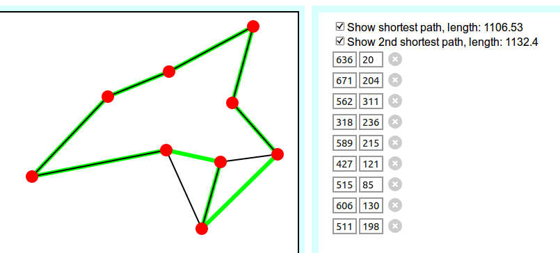

# visual-TSP
Visual-TSP - a web application for [travelling salesman problem](https://en.wikipedia.org/wiki/Travelling_salesman_problem) visualization and solving.

##Client Installation

Edit *build.sh* Bash script and set TARGET_DIR as you wish.

*Visual-tsp.js* file is a result of compilation from *visual-tsp-jsx.js* file.  
*Visual-tsp.js* is a precompiled file, but if a recompilation is needed, a compiler such as [Babel JS](https://babeljs.io/) is required for React JSX compiling.  
To start experimenting with TSP, open *visual-tsp.html* in your browser.  
Make sure your browser is up-to-date enough to be able to handle [ES6](https://developer.mozilla.org/en-US/docs/Web/JavaScript/New_in_JavaScript/ECMAScript_6_support_in_Mozilla).

##Server Installation

Client side application contains a TSP solver, but server side calculation is recommended for smoother UX.  
'servers' directory contains TSP solver implementations for Python and Node.js.

Python application is based on Tornado server, see http://www.tornadoweb.org/en/stable/ for installation instructions.  
Once you have Tornado installed, start the server with command **python3 tsp-solver.py**

Node.js application is based on [express](https://www.npmjs.com/package/express), [express-ws](https://www.npmjs.com/package/express-ws) and [permutation-engine](https://www.npmjs.com/package/permutation-engine).  
Install tsp-solver.js with command **npm install**  
Start the server with command **node tsp-solver.js**

##TSP solving algorithms

Currently all implementations use brute force search to find the shortest routes. Brute force search is very ineffective way to solve a TSP and therefore the maximum count of "cities" is limited to 9.

##3rd party libraries

This project includes a permutation-engine.js file from https://github.com/eriksank/permutation-engine

Following libraries are utilized via CDN:

oCanvas - Canvas drawing made easy http://ocanvas.org/  
Redux - Application state container http://redux.js.org/  
React - For listing the coordinates etc. https://facebook.github.io/react/  
jQuery - For generic DOM manipulation etc. http://jquery.com/

##Contributing

Server implementations with different TSP solving algorithms are welcome. Each server should have their own directory under servers directory. Directories should be named with following naming convention: *implementationLanguage-algorithmName*

##License

**For permutation-engine.js:**   
Copyright (c) 2012 Erik Poupaert.  
Licensed under the Library General Public License (LGPL).  

**For the rest of the files:**   
Copyright (c) 2016 Jussi Utunen  
Licensed under the MIT License:

Permission is hereby granted, free of charge, to any person obtaining a copy
of this software and associated documentation files (the "Software"), to deal
in the Software without restriction, including without limitation the rights
to use, copy, modify, merge, publish, distribute, sublicense, and/or sell
copies of the Software, and to permit persons to whom the Software is
furnished to do so, subject to the following conditions:

The above copyright notice and this permission notice shall be included in all
copies or substantial portions of the Software.

THE SOFTWARE IS PROVIDED "AS IS", WITHOUT WARRANTY OF ANY KIND, EXPRESS OR
IMPLIED, INCLUDING BUT NOT LIMITED TO THE WARRANTIES OF MERCHANTABILITY,
FITNESS FOR A PARTICULAR PURPOSE AND NONINFRINGEMENT. IN NO EVENT SHALL THE
AUTHORS OR COPYRIGHT HOLDERS BE LIABLE FOR ANY CLAIM, DAMAGES OR OTHER
LIABILITY, WHETHER IN AN ACTION OF CONTRACT, TORT OR OTHERWISE, ARISING FROM,
OUT OF OR IN CONNECTION WITH THE SOFTWARE OR THE USE OR OTHER DEALINGS IN THE
SOFTWARE.
